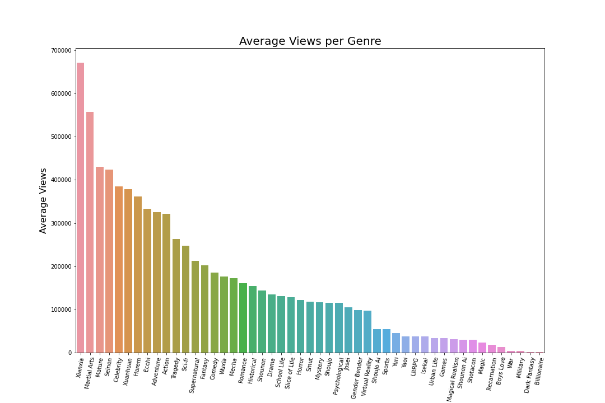

# scraping light novel data
I figured out the best specifications for a light novel, check it out! (still a bit in the works)

## Why?
Writing can be hard. My analysis makes it easier for a new author to start writing and allows them to make data driven choices while doing so. Hopefully more works can be written because of my work and enrich our culture. 

## What I did:
I used requests to access the novel list on the site, extracted all the novels by letter, and for each novel I extracted a bunch of parameters using bs4:
name, alternative name, artists, author, description, genres, original language, latest chapters, taring, status, tags, total views, type, year, similar novels, and chapter count. Then I used a combination of seaborn, pandas, and scipy.stats to analyze this dataset and generate significant insight to aid authors. 

## Some things I did and I am not so happy with:
1.  I assumed all chapter names are numbered, which was not true (some chapters were called epilogue for example). This might have messed up my chapter counts and random chapter content extraction
2.  I threaded the scraping, which is completely unneccessary looking back. I did this considering that this is an I/O bound task, but forgot to consider that doing so might look like a website attack from the other end. Need to read up more on scraping before I try again and use proper etiquette. 
3.  I formatted the genres into a single cell (FIXED)
4.  I used a try-except blocks to make sure code runs
5.  The content of the chapters didn't load to the dataframe

## How I would fix them if I did this again:
1. I would count the existing chapters to get an accurate chapter count, create a list of links to each chapter, and access that list through the random number. This will allow me to not care about chapter names whatsoever. 
2. A simple for loop over the links, maybe followed by a time.sleep to not lose connection and overload the site. 
3. Get a list of the genres (either hardcoded before scraping or through the scrape itself) and use each genre as a key.
4. Most of the errors I was getting were due to some of the above problems, but I would go through my errors and try to avoid try-except blocks, or at the very least do a better job at using them by specifying specific errors. 
5. Convert the Counter into a list of words before loading to the dataframe

